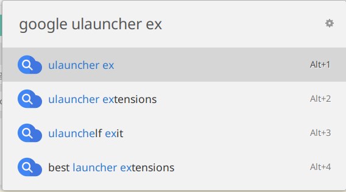

# Google Search

This is a Ulauncher extension to search on Google.

## Table of Contents

- [Google Search](#google-search)
  - [Table of Contents](#table-of-contents)
  - [Screenshot](#screenshot)
  - [Installation](#installation)
    - [Requirements](#requirements)
    - [Ulauncher's GUI](#ulaunchers-gui)
    - [Manually from source](#manually-from-source)
  - [Configuration](#configuration)
  - [Usage](#usage)
  - [License](#license)

## Screenshot

## Installation

### Requirements

No external modules are required.

### Ulauncher's GUI

1. Open Ulauncher's settings and the "Extensions" tab
2. Click "Add extension" button
3. Paste this URL: `https://github.com/NastuzziSamy/ulauncher-google-search`
4. Click "Add" button – the extension will be installed

### Manually from source

The extensions' directory is located at: `$HOME/.local/share/ulauncher/extensions`

Go to that location, and while being inside, just `git clone` this repository.

## Configuration

In Ulauncher's settings, you can custom some settings:
- Keyword
  - default: `google`

## Usage

To search on Google, use the keyword (default is `google`), then type/paste and wait for the extension to load.

You will see the 10 top searches. Just click/press ENTER on one to see it on your default browser.

## License

[MIT License](LICENSE)
